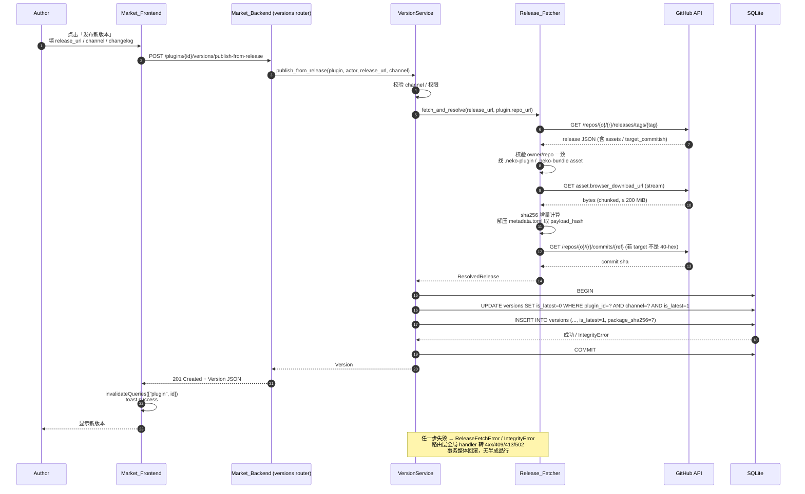
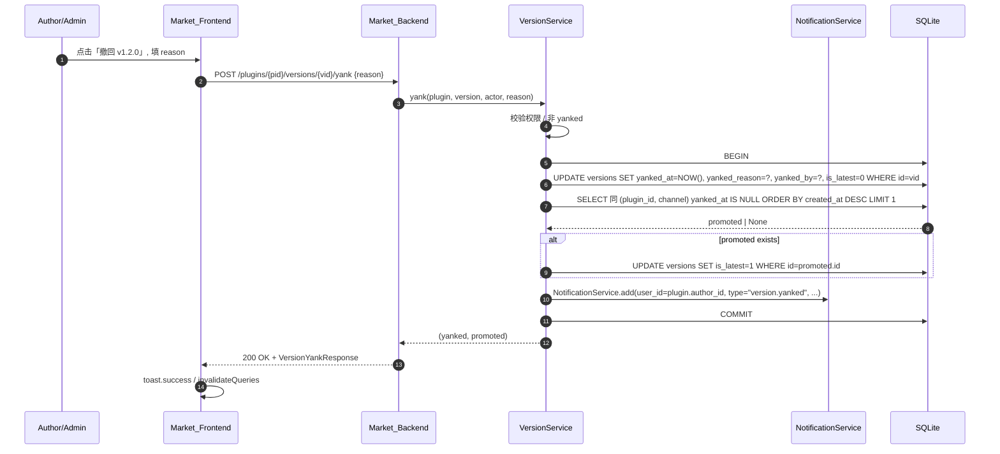

# Design Document — Market 插件版本管理

## Overview

本设计文档把 requirements.md 中的 R0–R9 与 P0–P3 落地为可实施的代码 diff、迁移脚本骨架、模块结构与测试方案。核心目标只有一个：**把 Plugin Market 的下载链路打通**，让客户端通过 `GET /api/v1/plugins/{id}/versions/latest` 拿到的 `package_url` 必然指向真实可下载、可校验的 `.neko-plugin` / `.neko-bundle` 文件；版本管理（`channel` / `is_latest` / `yank`）作为同步实现的最小集合，能够支撑作者自助发版与撤回。

本特性是重构而不是增量改进：

- 删除 `plugins.version` / `plugins.download_url` 列。
- 删除 `POST /api/v1/plugins/{id}/versions`（手填 sha256）与 `DELETE /api/v1/plugins/{id}/versions/{version_id}`。
- 重写 `latest` 接口语义：仅返回 `is_latest = TRUE AND yanked_at IS NULL`，不再 fallback。
- N.E.K.O 客户端代码不在本 spec 范围内，仅以"待客户端 spec 适配的 breaking change"形式文档化。

整套设计的部署假设是 **FastAPI + uvicorn 单进程**（与 `app/main.py` 现状一致），并发安全由数据库事务 + SQLite partial unique index 强约束。

---

## Architecture

### 组件关系图

```mermaid
flowchart LR
    Author[Author<br/>插件作者]
    Admin[Admin<br/>管理员]
    Frontend[Market_Frontend<br/>NEKO_Plugins_Market/]
    Backend[Market_Backend<br/>app/]
    Fetcher[Release_Fetcher<br/>app/services/release_fetcher.py]
    VersionSvc[VersionService<br/>app/services/version_service.py]
    Notif[NotificationService]
    GitHub[(GitHub API)]
    DB[(SQLite<br/>versions / plugins)]
    NEKO[NEKO_Client<br/>不在本 spec 范围]

    Author -->|表单提交 release_url| Frontend
    Admin -->|yank reason| Frontend
    Frontend -->|REST + JWT| Backend
    Backend -->|publish-from-release| Fetcher
    Fetcher -->|GET /releases/tags/{tag}<br/>GET asset stream<br/>GET /commits/{ref}| GitHub
    Backend --> VersionSvc
    VersionSvc -->|事务内切 is_latest<br/>+ insert Version| DB
    VersionSvc -->|yank latest 时| Notif
    Notif --> DB
    NEKO -.->|GET /versions/latest<br/>下载 package_url| Backend
```

### 模块划分（按文件路径列出新增 / 修改 / 删除）

**新增**

| 文件 | 用途 |
|---|---|
| `app/services/release_fetcher.py` | GitHub release 拉取、asset 流式下载、sha256 计算、metadata.toml 解析 |
| `app/services/plugin_projection.py` | 把 `latest_version` 子对象批量挂到 Plugin 实例上 |
| `app/errors/version_errors.py` | `ReleaseFetchError` / `VersionDomainError` 与错误码常量 |
| `alembic/versions/<ts>_market_version_management.py` | 数据迁移 |
| `tests/properties/test_version_management.py` | Hypothesis PBT 套件 |
| `NEKO_Plugins_Market/src/components/versions/PublishFromReleaseDialog.tsx` | 发版表单 Dialog |
| `NEKO_Plugins_Market/src/components/versions/YankDialog.tsx` | 撤回原因 Dialog |
| `NEKO_Plugins_Market/src/components/versions/VersionList.tsx` | 详情页"版本"tab 主体 |

**修改**

| 文件 | 改动要点 |
|---|---|
| `app/models/version.py` | 新增 `channel` / `is_latest` / `yanked_at` / `yanked_reason` / `yanked_by` / `published_by` 字段；保留现有列 |
| `app/models/plugin.py` | 删除 `version` / `download_url` 列；移除 `to_frontend_dict()` 内对这两列的读取 |
| `app/schemas/version.py` | 移除 `VersionCreate`；新增 `VersionPublishRequest` / `VersionYankRequest` / `Version`（含新字段） |
| `app/schemas/plugin.py` | 移除 `version` / `download_url`；新增 `LatestVersionPublic` 与 `Plugin.latest_version` |
| `app/services/version_service.py` | 删除 `create_version` / `delete_version`；新增 `publish_from_release` / `yank` / `list_versions` / `get_latest` |
| `app/services/plugin_service.py` | 在列表 / 详情查询后调 `attach_latest_version` |
| `app/routers/versions.py` | 删除旧 CRUD 路由，新增 `publish-from-release` / `yank`，重写 `list` / `latest` |
| `app/main.py` | 注册 `ReleaseFetchError` / `VersionDomainError` 全局 exception handler |
| `NEKO_Plugins_Market/src/services/types.ts` | 移除 `Plugin.version` / `Plugin.download_url`；新增 `LatestVersion`、`PluginVersion` 字段扩展 |
| `NEKO_Plugins_Market/src/services/versions.ts` | 移除 `create()`，新增 `publishFromRelease()` / `yank()`；`list()` 支持 `channel` / `include_yanked` |
| `NEKO_Plugins_Market/src/services/mappers.ts` | `toMarketPlugin` 改用 `plugin.latest_version.package_url` |
| `NEKO_Plugins_Market/src/pages/PluginDetail.tsx` | 新增 Versions tab，挂载 `VersionList` |
| `NEKO_Plugins_Market/src/pages/MyPlugins.tsx` | 已发布插件卡片新增"发布新版本"按钮 |

**删除**

| 路径 | 理由 |
|---|---|
| `POST /api/v1/plugins/{id}/versions` 路由 | 被 `publish-from-release` 替代 |
| `DELETE /api/v1/plugins/{id}/versions/{version_id}` 路由 | 撤回统一走 `yank` |
| `app/schemas/version.py` 中 `VersionCreate` | 不再有手填 sha256 的请求体 |
| `app/services/version_service.py` 中 `create_version` / `delete_version` / `_sync_plugin_current_version` | 见上 |
| `Plugin.version` / `Plugin.download_url` 列 | 数据迁移到 `versions` 表 |

---

## Data Models

### `versions` 表新增列

| 列 | 类型 | 约束 | 默认值 | 说明 |
|---|---|---|---|---|
| `channel` | `VARCHAR(16)` | `NOT NULL`, `CHECK (channel IN ('stable','beta'))` | `'stable'` | 发布渠道，仅枚举两值 |
| `is_latest` | `BOOLEAN` | `NOT NULL` | `FALSE` | 是否为所属 (plugin, channel) 的当前最新版 |
| `yanked_at` | `DATETIME` | `NULL` | `NULL` | 撤回时间，非空即视为已 yank |
| `yanked_reason` | `TEXT` | `NULL` | `NULL` | 撤回原因，1–500 字符 |
| `yanked_by` | `INTEGER` | FK → `users.id` `ON DELETE SET NULL` | `NULL` | 操作者 |
| `published_by` | `INTEGER` | FK → `users.id` `ON DELETE SET NULL` | `NULL` | 发版操作者 |

`package_sha256` 列保持原 `VARCHAR(64) NULL`，但**新发版路径写入时强制非空且 lowercase hex**（由 `VersionService.publish_from_release` 保证，不在 DB 层加 NOT NULL 以兼容迁移期间的 legacy 占位行）。

### `plugins` 表删除列

```sql
ALTER TABLE plugins DROP COLUMN version;
ALTER TABLE plugins DROP COLUMN download_url;
```

由于 SQLite 不支持原生 `DROP COLUMN`（直到 3.35 起支持但 Alembic 仍走 batch_alter_table 重建），必须在迁移脚本中用 `op.batch_alter_table('plugins')` 触发表重建。

### SQLite Partial Unique Index DDL

```sql
CREATE UNIQUE INDEX uq_versions_plugin_channel_latest
ON versions (plugin_id, channel)
WHERE is_latest = 1;
```

在 Alembic 中：

```python
op.create_index(
    "uq_versions_plugin_channel_latest",
    "versions",
    ["plugin_id", "channel"],
    unique=True,
    sqlite_where=sa.text("is_latest = 1"),
)
```

如果 SQLAlchemy 版本不支持 `sqlite_where`（< 1.4 早期），用 `op.execute("CREATE UNIQUE INDEX ... WHERE is_latest = 1")` 兜底。

### `(plugin_id, version)` 唯一索引

```python
op.create_index(
    "uq_versions_plugin_version",
    "versions",
    ["plugin_id", "version"],
    unique=True,
)
```

### CHECK 约束

```sql
CHECK (channel IN ('stable','beta'))
```

通过 `sa.CheckConstraint("channel IN ('stable','beta')", name="ck_versions_channel")` 在 batch_alter_table 中加入。

### 所有外键的 `ON DELETE` 策略

| 外键 | 行为 |
|---|---|
| `versions.plugin_id → plugins.id` | `ON DELETE CASCADE`（保持现有 `cascade="all, delete-orphan"` 一致） |
| `versions.yanked_by → users.id` | `ON DELETE SET NULL` |
| `versions.published_by → users.id` | `ON DELETE SET NULL` |

注意：原 `versions.plugin_id` 在 `20260505_0001_fresh_schema.py` 中没有显式 `ondelete`，迁移时通过 batch_alter_table 显式补上 `ondelete='CASCADE'`。

### 更新后的 `app/models/version.py` 字段定义（节选）

```python
class Version(Base):
    __tablename__ = "versions"

    id = Column(Integer, primary_key=True, index=True)
    plugin_id = Column(Integer, ForeignKey("plugins.id", ondelete="CASCADE"), nullable=False)

    version = Column(String(20), nullable=False)
    changelog = Column(Text, nullable=True)

    channel = Column(String(16), nullable=False, default="stable")
    is_latest = Column(Boolean, nullable=False, default=False)

    yanked_at = Column(DateTime, nullable=True)
    yanked_reason = Column(Text, nullable=True)
    yanked_by = Column(Integer, ForeignKey("users.id", ondelete="SET NULL"), nullable=True)

    published_by = Column(Integer, ForeignKey("users.id", ondelete="SET NULL"), nullable=True)

    download_url = Column(String(500), nullable=True)
    package_url = Column(String(500), nullable=True)
    package_sha256 = Column(String(64), nullable=True)
    payload_hash = Column(String(64), nullable=True)
    release_tag = Column(String(100), nullable=True)
    release_url = Column(String(500), nullable=True)
    source_repo_url = Column(String(500), nullable=True)
    source_commit = Column(String(64), nullable=True)
    actions_run_url = Column(String(500), nullable=True)
    neko_repo = Column(String(200), nullable=True)
    neko_ref = Column(String(100), nullable=True)
    neko_commit = Column(String(64), nullable=True)
    verification_status = Column(String(20), nullable=False, default="unverified")
    verification_summary = Column(Text, nullable=True)

    min_app_version = Column(String(20), nullable=True)
    max_app_version = Column(String(20), nullable=True)

    created_at = Column(DateTime, default=utc_now)

    plugin = relationship("Plugin", back_populates="versions")

    __table_args__ = (
        CheckConstraint("channel IN ('stable','beta')", name="ck_versions_channel"),
    )
```

---

## Alembic 迁移脚本骨架

**文件名**：`Plugin Market (Backend + Frontend)/alembic/versions/<timestamp>_market_version_management.py`

**revision 链**：`down_revision = '20260505_0001'`（即接在 `fresh_schema` 之后）。

### `upgrade()` 步骤逐项

```python
def upgrade() -> None:
    # ---- 1. versions 表加新列（先 nullable=True，便于 backfill） ----
    with op.batch_alter_table("versions", recreate="auto") as batch:
        batch.add_column(sa.Column("channel", sa.String(length=16), nullable=True))
        batch.add_column(sa.Column("is_latest", sa.Boolean(), nullable=True))
        batch.add_column(sa.Column("yanked_at", sa.DateTime(), nullable=True))
        batch.add_column(sa.Column("yanked_reason", sa.Text(), nullable=True))
        batch.add_column(sa.Column("yanked_by", sa.Integer(), nullable=True))
        batch.add_column(sa.Column("published_by", sa.Integer(), nullable=True))

    # ---- 2. backfill：所有现存 versions 行 channel='stable', is_latest=false ----
    op.execute("UPDATE versions SET channel = 'stable' WHERE channel IS NULL")
    op.execute("UPDATE versions SET is_latest = 0 WHERE is_latest IS NULL")

    # ---- 3. 每个 plugin_id 的 created_at desc 第一条置 is_latest=1 ----
    op.execute("""
        UPDATE versions SET is_latest = 1
        WHERE id IN (
            SELECT id FROM (
                SELECT v.id,
                       ROW_NUMBER() OVER (PARTITION BY v.plugin_id ORDER BY v.created_at DESC, v.id DESC) AS rn
                FROM versions v
            ) ranked
            WHERE rn = 1
        )
    """)

    # ---- 4. 为 plugins.download_url 非空但 versions 表无对应记录的 plugin 补 legacy 行 ----
    op.execute("""
        INSERT INTO versions (
            plugin_id, version, channel, is_latest, yanked_at,
            download_url, package_url, package_sha256,
            verification_status, published_by, created_at
        )
        SELECT p.id,
               COALESCE(p.version, '0.0.0'),
               'stable',
               1,
               NULL,
               p.download_url,
               p.download_url,
               '',
               'legacy_unverified',
               p.author_id,
               COALESCE(p.published_at, p.created_at)
        FROM plugins p
        WHERE (p.download_url IS NOT NULL AND p.download_url <> '')
          AND NOT EXISTS (SELECT 1 FROM versions v WHERE v.plugin_id = p.id)
    """)

    # ---- 5. 把新列改为 NOT NULL + 加 CHECK + 加 FK ----
    with op.batch_alter_table("versions", recreate="auto") as batch:
        batch.alter_column("channel", existing_type=sa.String(length=16), nullable=False, server_default="stable")
        batch.alter_column("is_latest", existing_type=sa.Boolean(), nullable=False, server_default=sa.text("0"))
        batch.create_check_constraint("ck_versions_channel", "channel IN ('stable','beta')")
        batch.create_foreign_key(
            "fk_versions_yanked_by_users", "users", ["yanked_by"], ["id"], ondelete="SET NULL"
        )
        batch.create_foreign_key(
            "fk_versions_published_by_users", "users", ["published_by"], ["id"], ondelete="SET NULL"
        )
        # 补 plugin_id 的 ondelete=CASCADE
        batch.drop_constraint("fk_versions_plugin_id_plugins", type_="foreignkey")
        batch.create_foreign_key(
            "fk_versions_plugin_id_plugins", "plugins", ["plugin_id"], ["id"], ondelete="CASCADE"
        )

    # ---- 6. 创建 partial unique index 与 (plugin_id, version) unique index ----
    op.create_index(
        "uq_versions_plugin_channel_latest",
        "versions",
        ["plugin_id", "channel"],
        unique=True,
        sqlite_where=sa.text("is_latest = 1"),
    )
    op.create_index(
        "uq_versions_plugin_version",
        "versions",
        ["plugin_id", "version"],
        unique=True,
    )

    # ---- 7. 删除 plugins.version、plugins.download_url ----
    with op.batch_alter_table("plugins", recreate="auto") as batch:
        batch.drop_column("version")
        batch.drop_column("download_url")
```

> 备注：`batch_alter_table("...", recreate="auto")` 让 Alembic 在 SQLite 上自动走"建临时表 → 复制数据 → 删旧表 → 重命名"流程，这是处理 `ALTER COLUMN` / `DROP COLUMN` / `ADD CHECK` / `ADD FK` 的标准做法。

### `downgrade()`（最简实现）

```python
def downgrade() -> None:
    op.drop_index("uq_versions_plugin_version", table_name="versions")
    op.drop_index("uq_versions_plugin_channel_latest", table_name="versions")
    with op.batch_alter_table("versions", recreate="auto") as batch:
        batch.drop_constraint("ck_versions_channel", type_="check")
        batch.drop_constraint("fk_versions_yanked_by_users", type_="foreignkey")
        batch.drop_constraint("fk_versions_published_by_users", type_="foreignkey")
        batch.drop_column("published_by")
        batch.drop_column("yanked_by")
        batch.drop_column("yanked_reason")
        batch.drop_column("yanked_at")
        batch.drop_column("is_latest")
        batch.drop_column("channel")
    with op.batch_alter_table("plugins", recreate="auto") as batch:
        batch.add_column(sa.Column("version", sa.String(length=20), nullable=False, server_default="0.0.0"))
        batch.add_column(sa.Column("download_url", sa.String(length=500), nullable=True))
```

`downgrade` 不还原数据搬运（被搬到 versions 的 download_url 不会回填回 plugins）。requirement 9 已声明 downgrade 不强制完美。

---

## Components and Interfaces

### Release_Fetcher

**文件**：`app/services/release_fetcher.py`

**对外接口**：

```python
from dataclasses import dataclass

@dataclass(frozen=True)
class ResolvedRelease:
    package_url: str           # asset 的 browser_download_url
    package_sha256: str        # 64 字符 lowercase hex
    payload_hash: str | None   # metadata.toml [payload].hash，缺失为 None
    release_tag: str           # 已去除前导 v/V，例如 "1.2.0"
    release_url_canonical: str # release HTML 页 URL（GitHub html_url）
    source_commit: str         # 40 字符 commit sha
    asset_filename: str        # 例如 "my-plugin-1.2.0.neko-plugin"
    asset_bytes_size: int      # 字节数

class ReleaseFetcher:
    def __init__(self, http_client_factory=None, *, max_asset_bytes: int = 200 * 1024 * 1024):
        ...

    async def fetch_and_resolve(
        self,
        *,
        release_url: str,
        plugin_repo_url: str,
    ) -> ResolvedRelease:
        ...
```

**内部步骤（与 R3 / R9 严格对应）**

1. **解析 `release_url`**：从形如 `https://github.com/{owner}/{repo}/releases/tag/{tag}` 或 `https://github.com/{owner}/{repo}/releases/{id}` 中提取 `owner` / `repo` / `tag`。无法解析抛 `ReleaseFetchError("release_repo_mismatch", ...)`。
2. **校验 owner/repo 与 plugin_repo_url 一致**：复用 `GitHubService._parse_repo_url` 解析两者后大小写不敏感比较 (`a.casefold() == b.casefold()`)。不一致抛 `ReleaseFetchError("release_repo_mismatch", ...)`。
3. **GET release 元数据**：调 `GET https://api.github.com/repos/{owner}/{repo}/releases/tags/{tag}`，复用 `GitHubService.headers` 拼 `Authorization`。404 抛 `ReleaseFetchError("release_publish_failed", "GitHub release 不存在")`。
4. **遍历 `assets`**：找第一个 `name.lower().endswith(".neko-plugin")` 或 `.neko-bundle` 的 asset。找不到抛 `ReleaseFetchError("release_asset_not_found", ...)`。
5. **流式下载 asset**：
    ```python
    async with httpx.AsyncClient(follow_redirects=True, timeout=httpx.Timeout(60.0, connect=10.0)) as client:
        async with client.stream("GET", asset.browser_download_url, headers=...) as resp:
            resp.raise_for_status()
            hasher = hashlib.sha256()
            buffer = io.BytesIO()
            total = 0
            async for chunk in resp.aiter_bytes(chunk_size=64 * 1024):
                total += len(chunk)
                if total > self.max_asset_bytes:
                    raise ReleaseFetchError("release_asset_too_large", ...)
                hasher.update(chunk)
                buffer.write(chunk)
            package_sha256 = hasher.hexdigest()
            asset_bytes = buffer.getvalue()
    ```
    禁用 gzip 自动解压：通过 `headers={"Accept-Encoding": "identity"}` 强制。
6. **解析 metadata.toml**：
    ```python
    try:
        with zipfile.ZipFile(io.BytesIO(asset_bytes)) as zf:
            with zf.open("metadata.toml") as fp:
                data = tomllib.loads(fp.read().decode("utf-8"))
        payload_hash = data.get("payload", {}).get("hash")
        if not isinstance(payload_hash, str) or not re.fullmatch(r"[0-9a-fA-F]{64}", payload_hash):
            payload_hash = None
        else:
            payload_hash = payload_hash.lower()
    except (zipfile.BadZipFile, KeyError, tomllib.TOMLDecodeError, UnicodeDecodeError):
        payload_hash = None
    ```
    Python 3.11 的 `tomllib` 已内置；Python 3.10 需用 `tomli`。pyproject.toml 已声明 `>=3.11`，直接 `import tomllib`。
7. **解析 commit sha**：
    ```python
    target = release_data["target_commitish"]  # "main" / "1.2.x" / 40-hex / ...
    if re.fullmatch(r"[0-9a-fA-F]{40}", target):
        source_commit = target.lower()
    else:
        commit_resp = await client.get(f"{API}/repos/{owner}/{repo}/commits/{target}", headers=...)
        commit_resp.raise_for_status()
        source_commit = commit_resp.json()["sha"].lower()
    ```
8. **去除 tag 前导 `v` / `V`**：`release_tag_clean = re.sub(r"^[vV]", "", release_data["tag_name"])`。
9. **重试策略**：步骤 3、5、7 中遇到 `httpx.ConnectError` / `httpx.ReadTimeout` / `httpx.RemoteProtocolError` / 5xx / 429，重试 1 次，等待 0.5s（`await asyncio.sleep(0.5)`）。第二次仍失败抛 `ReleaseFetchError("release_publish_failed", ...)`。
10. **错误类型**：

```python
class ReleaseFetchError(Exception):
    def __init__(self, code: str, message: str):
        self.code = code
        self.message = message
        super().__init__(f"[{code}] {message}")
```

`code` 取值集合（与 R9.2 错误码一致）：

- `release_repo_mismatch`
- `release_asset_not_found`
- `release_asset_too_large`
- `release_publish_failed`

`invalid_channel` 与 `version_already_exists` 不在 fetcher 抛出，而是在 `VersionService.publish_from_release` 抛 `VersionDomainError` 处理。

### VersionService 重构

**文件**：`app/services/version_service.py`

```python
class VersionService:

    @staticmethod
    async def get_version_by_id(db: AsyncSession, version_id: int) -> Version | None: ...

    @staticmethod
    async def list_versions(
        db: AsyncSession,
        plugin_id: int,
        *,
        channel: str | None = None,
        include_yanked: bool = False,
    ) -> list[Version]:
        """按 created_at desc 返回；channel/include_yanked 见 R5。"""

    @staticmethod
    async def get_latest(
        db: AsyncSession,
        plugin_id: int,
        *,
        channel: str = "stable",
    ) -> Version | None:
        """仅返回 is_latest=true AND yanked_at IS NULL 的那条。"""

    @staticmethod
    async def publish_from_release(
        db: AsyncSession,
        *,
        plugin: Plugin,
        actor: User,
        release_url: str,
        channel: str = "stable",
        changelog: str | None = None,
        fetcher: ReleaseFetcher | None = None,
    ) -> Version:
        """R3 主流程。"""

    @staticmethod
    async def yank(
        db: AsyncSession,
        *,
        plugin: Plugin,
        version: Version,
        actor: User,
        reason: str,
    ) -> tuple[Version, Version | None]:
        """R4 主流程。返回 (yanked_version, promoted_version | None)。
        promoted_version 由调用方序列化进 audit log，与 notification 文案。
        """
```

#### `publish_from_release` 内部流程

```text
1. 校验 channel ∈ {"stable","beta"}，否则抛 VersionDomainError("invalid_channel", ...)
2. 校验权限：actor.id == plugin.author_id or actor.is_admin or actor 拥有 plugin_management 权限
   否则抛 VersionDomainError("forbidden", ...)
3. fetcher = fetcher or ReleaseFetcher()
   resolved = await fetcher.fetch_and_resolve(
       release_url=release_url,
       plugin_repo_url=plugin.repo_url,
   )  # 任何 ReleaseFetchError 由路由层全局 handler 转 4xx/502
4. 在 commit_or_rollback(db) 内：
   a. SELECT FROM versions WHERE plugin_id=? AND version=? FOR UPDATE
      SQLite 没有 FOR UPDATE：靠 (plugin_id, version) UNIQUE INDEX 抛 IntegrityError
   b. 把同 plugin + 同 channel 的 is_latest=true 行 UPDATE 为 false
   c. 新建 Version(
         plugin_id=plugin.id,
         version=resolved.release_tag,
         channel=channel,
         is_latest=True,
         yanked_at=None,
         changelog=changelog,
         download_url=resolved.package_url,
         package_url=resolved.package_url,
         package_sha256=resolved.package_sha256,  # 必须 lowercase hex 64
         payload_hash=resolved.payload_hash,
         release_tag=resolved.release_tag,
         release_url=resolved.release_url_canonical,
         source_commit=resolved.source_commit,
         source_repo_url=plugin.repo_url,
         published_by=actor.id,
         verification_status="passed",
       )
   d. db.add(new_version); flush()  ← IntegrityError → VersionDomainError("version_already_exists")
5. 结构化日志：logger.info("version.publish_from_release", extra={...})
6. return new_version
```

#### `yank` 内部流程

```text
1. 校验权限同上；非作者非 admin → VersionDomainError("forbidden")
2. 校验 version.plugin_id == plugin.id（router 已校验，service 二次防御）
3. if version.yanked_at is not None: raise VersionDomainError("version_already_yanked")
4. 在 commit_or_rollback(db) 内：
   a. version.yanked_at = utc_now()
      version.yanked_reason = reason
      version.yanked_by = actor.id
   b. promoted = None
      if version.is_latest:
          version.is_latest = False
          # 候选：同 plugin + 同 channel + yanked_at IS NULL + created_at desc + id desc 第一条
          q = select(Version).where(
                Version.plugin_id == plugin.id,
                Version.channel == version.channel,
                Version.yanked_at.is_(None),
                Version.id != version.id,
              ).order_by(desc(Version.created_at), desc(Version.id)).limit(1)
          promoted = (await db.execute(q)).scalar_one_or_none()
          if promoted is not None:
              promoted.is_latest = True
   c. (注意：partial unique index 在事务提交时校验，因此先把旧 latest 置 false、再把新 latest 置 true 是安全的)
5. 事务提交后调用：
   NotificationService.add(
     db,
     user_id=plugin.author_id,
     type="version.yanked",
     title=f"插件 {plugin.name} 的 v{version.version} ({version.channel}) 已被{('管理员' if actor.is_admin and actor.id != plugin.author_id else '作者本人')}撤回",
     content=reason,
     target_url=f"/plugin/{plugin.id}?tab=versions",
   )
   await db.commit()
6. audit log via app.routers.admin.logs：
   AuditLogService.record(actor_id=actor.id, action="version.yank", target_type="version",
                          target_id=version.id, details={"plugin_id": plugin.id, "reason": reason})
7. return (version, promoted)
```

### Plugin 投影 `latest_version`

**文件**：`app/services/plugin_projection.py`

```python
from sqlalchemy import select
from sqlalchemy.ext.asyncio import AsyncSession

from app.models.plugin import Plugin
from app.models.version import Version


async def attach_latest_version(
    db: AsyncSession,
    plugins: list[Plugin],
    *,
    channel: str = "stable",
) -> None:
    """在 list/detail 接口序列化前调用，把 latest_version 子对象作为临时属性挂到每个 plugin 上。"""
    if not plugins:
        return
    plugin_ids = [p.id for p in plugins]
    rows = await db.execute(
        select(Version).where(
            Version.plugin_id.in_(plugin_ids),
            Version.channel == channel,
            Version.is_latest.is_(True),
            Version.yanked_at.is_(None),
        )
    )
    by_plugin: dict[int, Version] = {v.plugin_id: v for v in rows.scalars().all()}
    for plugin in plugins:
        # 用对象的 __dict__ 直接挂临时属性，避免 SQLAlchemy hybrid_property 复杂度
        plugin.__dict__["latest_version"] = by_plugin.get(plugin.id)
```

调用位置：

- `PluginService.get_plugins(...)` 返回前对 `items` 调用一次。
- `PluginService.get_plugin_by_id(...)` 返回单条前对 `[plugin]` 调用一次。
- `routers/plugins.py` 中所有暴露 plugin 对象的端点。

### Pydantic Schema 更新

**`app/schemas/plugin.py`**

```python
class LatestVersionPublic(BaseModel):
    model_config = ConfigDict(from_attributes=True)

    version: str
    channel: str          # "stable" | "beta"
    package_url: str
    package_sha256: str   # 64 chars lowercase hex
    payload_hash: str | None
    created_at: datetime


class Plugin(BaseModel):
    model_config = ConfigDict(from_attributes=True)

    id: int
    name: str
    slug: str
    short_description: str | None
    author_id: int
    author_name: str
    icon_url: str | None
    repo_url: str | None
    readme: str | None
    zone_id: int | None
    zone_slug: str | None
    tags: list[str]
    download_count: int
    likes: int
    rating_average: float
    rating_count: int
    status: PluginStatus
    is_featured: int
    created_at: datetime
    updated_at: datetime
    published_at: datetime | None

    latest_version: LatestVersionPublic | None = None
    # 不再有 version: str / download_url: str | None
```

`PluginList` / `PluginDetail` 继承 `Plugin`，自动带上 `latest_version`。

**`app/schemas/version.py`**（重写）

```python
class VersionPublishRequest(BaseModel):
    release_url: str = Field(..., max_length=500)
    channel: Literal["stable", "beta"] = "stable"
    changelog: str | None = None


class VersionYankRequest(BaseModel):
    reason: str = Field(..., min_length=1, max_length=500)


class Version(BaseModel):
    model_config = ConfigDict(from_attributes=True)

    id: int
    plugin_id: int
    version: str
    channel: str
    is_latest: bool
    yanked_at: datetime | None
    yanked_reason: str | None
    yanked_by: int | None
    published_by: int | None
    changelog: str | None
    download_url: str | None
    package_url: str | None
    package_sha256: str | None
    payload_hash: str | None
    release_tag: str | None
    release_url: str | None
    source_commit: str | None
    source_repo_url: str | None
    actions_run_url: str | None
    neko_repo: str | None
    neko_ref: str | None
    neko_commit: str | None
    verification_status: str
    verification_summary: str | None
    min_app_version: str | None
    max_app_version: str | None
    created_at: datetime


class VersionYankResponse(BaseModel):
    yanked: Version
    promoted: Version | None
```

`VersionCreate` 整体删除。

### 路由层

**`app/routers/versions.py`**（重写后骨架）

```python
router = APIRouter()


@router.get("/plugins/{plugin_id}/versions", response_model=list[Version])
async def list_plugin_versions(
    plugin_id: int,
    channel: Literal["stable", "beta"] | None = None,
    include_yanked: bool = False,
    db: AsyncSession = Depends(get_db),
):
    plugin = await _ensure_plugin(db, plugin_id)
    return await VersionService.list_versions(
        db, plugin.id, channel=channel, include_yanked=include_yanked
    )


@router.get("/plugins/{plugin_id}/versions/latest", response_model=Version)
async def get_latest_version(
    plugin_id: int,
    channel: Literal["stable", "beta"] = "stable",
    db: AsyncSession = Depends(get_db),
):
    plugin = await _ensure_plugin(db, plugin_id)
    version = await VersionService.get_latest(db, plugin.id, channel=channel)
    if not version:
        raise VersionDomainError("latest_version_not_found", "该插件在此 channel 暂无可用版本")
    return version


@router.post(
    "/plugins/{plugin_id}/versions/publish-from-release",
    response_model=Version,
    status_code=status.HTTP_201_CREATED,
)
async def publish_from_release(
    plugin_id: int,
    body: VersionPublishRequest,
    current_user: User = Depends(get_current_user),
    db: AsyncSession = Depends(get_db),
):
    plugin = await _ensure_plugin(db, plugin_id)
    version = await VersionService.publish_from_release(
        db,
        plugin=plugin,
        actor=current_user,
        release_url=body.release_url,
        channel=body.channel,
        changelog=body.changelog,
    )
    return version


@router.post(
    "/plugins/{plugin_id}/versions/{version_id}/yank",
    response_model=VersionYankResponse,
)
async def yank_version(
    plugin_id: int,
    version_id: int,
    body: VersionYankRequest,
    current_user: User = Depends(get_current_user),
    db: AsyncSession = Depends(get_db),
):
    plugin = await _ensure_plugin(db, plugin_id)
    version = await VersionService.get_version_by_id(db, version_id)
    if not version or version.plugin_id != plugin_id:
        raise HTTPException(status_code=404, detail="版本不存在")
    yanked, promoted = await VersionService.yank(
        db, plugin=plugin, version=version, actor=current_user, reason=body.reason
    )
    return VersionYankResponse(yanked=yanked, promoted=promoted)
```

旧 `POST /plugins/{plugin_id}/versions` 与 `DELETE /plugins/{plugin_id}/versions/{version_id}` 路由从文件中删除，FastAPI 自动 404。

### 全局 Exception Handler

**`app/main.py`** 注册：

```python
from app.errors.version_errors import ReleaseFetchError, VersionDomainError, ERROR_CODE_TO_HTTP

@app.exception_handler(ReleaseFetchError)
async def _release_fetch_handler(_: Request, exc: ReleaseFetchError):
    http = ERROR_CODE_TO_HTTP.get(exc.code, 502)
    return JSONResponse(status_code=http, content={"detail": exc.message, "code": exc.code})

@app.exception_handler(VersionDomainError)
async def _version_domain_handler(_: Request, exc: VersionDomainError):
    http = ERROR_CODE_TO_HTTP.get(exc.code, 400)
    return JSONResponse(status_code=http, content={"detail": exc.message, "code": exc.code})
```

`app/errors/version_errors.py`：

```python
ERROR_CODE_TO_HTTP = {
    "forbidden": 403,
    "release_repo_mismatch": 400,
    "release_asset_not_found": 400,
    "release_asset_too_large": 413,
    "release_publish_failed": 502,
    "version_already_exists": 409,
    "version_already_yanked": 409,
    "latest_version_not_found": 404,
    "invalid_channel": 400,
}


class VersionDomainError(Exception):
    def __init__(self, code: str, message: str):
        self.code = code
        self.message = message
        super().__init__(f"[{code}] {message}")


class ReleaseFetchError(VersionDomainError):
    pass
```

让 `ReleaseFetchError` 继承 `VersionDomainError`，能用同一个 handler；保留两个类便于在测试 / 内部代码语义区分。

---

## 前端设计

### 类型层

**`NEKO_Plugins_Market/src/services/types.ts`**

```ts
// 旧 Plugin 接口移除 version / download_url；新增 latest_version
export interface LatestVersion {
  version: string;
  channel: "stable" | "beta";
  package_url: string;
  package_sha256: string;
  payload_hash: string | null;
  created_at: string;
}

export interface Plugin {
  id: number;
  name: string;
  slug: string;
  description?: string | null;
  short_description?: string | null;
  author_id: number;
  author_name: string;
  // version: string;          ← 删除
  // download_url?: string;    ← 删除
  latest_version: LatestVersion | null;
  icon_url?: string | null;
  repo_url?: string | null;
  readme?: string | null;
  zone_id?: number | null;
  zone_slug?: string | null;
  tags?: string[];
  download_count: number;
  likes: number;
  rating_average: number;
  rating_count: number;
  status: "approved" | "disabled" | string;
  is_featured: number;
  created_at: string;
  updated_at: string;
  published_at?: string | null;
}

// PluginVersion 扩展新字段
export interface PluginVersion {
  id: number;
  plugin_id: number;
  version: string;
  channel: "stable" | "beta" | string;
  is_latest: boolean;
  yanked_at: string | null;
  yanked_reason: string | null;
  yanked_by: number | null;
  published_by: number | null;
  changelog?: string | null;
  download_url?: string | null;
  package_url?: string | null;
  package_sha256?: string | null;
  payload_hash?: string | null;
  release_tag?: string | null;
  release_url?: string | null;
  source_commit?: string | null;
  source_repo_url?: string | null;
  verification_status: string;
  verification_summary?: string | null;
  min_app_version?: string | null;
  max_app_version?: string | null;
  created_at: string;
}

export interface VersionPublishRequest {
  release_url: string;
  channel?: "stable" | "beta";
  changelog?: string | null;
}

export interface VersionYankRequest {
  reason: string;
}

export interface VersionYankResponse {
  yanked: PluginVersion;
  promoted: PluginVersion | null;
}
```

`PluginVersionCreateRequest` 与 `versionsApi.create()` 一并删除。

### Service 层

**`NEKO_Plugins_Market/src/services/versions.ts`**

```ts
import { post, request } from "./http/client";
import type {
  PluginVersion,
  VersionPublishRequest,
  VersionYankRequest,
  VersionYankResponse
} from "./types";

interface ListParams {
  channel?: "stable" | "beta";
  includeYanked?: boolean;
}

export const versionsApi = {
  list(pluginId: number, params: ListParams = {}) {
    const query = new URLSearchParams();
    if (params.channel) query.set("channel", params.channel);
    if (params.includeYanked !== undefined) {
      query.set("include_yanked", String(params.includeYanked));
    }
    const qs = query.toString();
    return request<PluginVersion[]>(`/plugins/${pluginId}/versions${qs ? `?${qs}` : ""}`);
  },

  latest(pluginId: number, channel: "stable" | "beta" = "stable") {
    return request<PluginVersion>(`/plugins/${pluginId}/versions/latest?channel=${channel}`);
  },

  publishFromRelease(pluginId: number, body: VersionPublishRequest) {
    return post<PluginVersion>(`/plugins/${pluginId}/versions/publish-from-release`, body);
  },

  yank(pluginId: number, versionId: number, body: VersionYankRequest) {
    return post<VersionYankResponse>(
      `/plugins/${pluginId}/versions/${versionId}/yank`,
      body
    );
  }
};
```

**`NEKO_Plugins_Market/src/services/mappers.ts`** 修改 `toMarketPlugin`：

```ts
export function toMarketPlugin(plugin: Plugin): MarketPlugin {
  const latest = plugin.latest_version;
  return {
    id: String(plugin.id),
    name: plugin.name,
    description: plugin.description ?? plugin.short_description ?? "",
    version: latest?.version ?? "",                       // 没有版本就空字符串
    downloadUrl: latest?.package_url ?? "",               // 不再 fallback 到 repo_url
    // ...其余字段不变
  };
}
```

### 详情页 — Versions Tab

**`pages/PluginDetail.tsx`**

- Tabs 新增 `<TabsTrigger value="versions">版本</TabsTrigger>`，挂载 `<VersionList pluginId={Number(id)} plugin={plugin} />`。
- URL query 支持 `?tab=versions&action=publish`，组件 mount 时检测到 `action=publish` 自动打开发版 Dialog。

**`components/versions/VersionList.tsx`** 关键骨架

```tsx
import { useQuery, useQueryClient, useMutation } from "@tanstack/react-query";
import { Tabs, TabsList, TabsTrigger } from "@/components/ui/tabs";
import { Switch } from "@/components/ui/switch";
import { Badge } from "@/components/ui/badge";
import { Button } from "@/components/ui/button";
import { versionsApi } from "@/services/versions";
import { PublishFromReleaseDialog } from "./PublishFromReleaseDialog";
import { YankDialog } from "./YankDialog";

export function VersionList({ pluginId, plugin }: Props) {
  const [channel, setChannel] = useState<"all" | "stable" | "beta">("all");
  const [includeYanked, setIncludeYanked] = useState(true);
  const [publishOpen, setPublishOpen] = useState(false);
  const [yankTarget, setYankTarget] = useState<PluginVersion | null>(null);

  const qc = useQueryClient();
  const queryKey = ["plugin", pluginId, "versions", { channel, includeYanked }];
  const { data: versions = [], isLoading } = useQuery({
    queryKey,
    queryFn: () => versionsApi.list(pluginId, {
      channel: channel === "all" ? undefined : channel,
      includeYanked,
    }),
  });

  const isAuthor = currentUser?.id === plugin.author_id;
  const isAdmin = currentUser?.is_admin;
  const canManage = isAuthor || isAdmin;

  return (
    <>
      <header>
        <Tabs value={channel} onValueChange={v => setChannel(v as any)}>
          <TabsList>
            <TabsTrigger value="all">全部</TabsTrigger>
            <TabsTrigger value="stable">stable</TabsTrigger>
            <TabsTrigger value="beta">beta</TabsTrigger>
          </TabsList>
        </Tabs>
        <Switch checked={includeYanked} onCheckedChange={setIncludeYanked} />
        包含已撤回版本
        {canManage && (
          <Button onClick={() => setPublishOpen(true)}>发布新版本</Button>
        )}
      </header>
      <ul>
        {versions.map(v => (
          <VersionRow
            key={v.id}
            version={v}
            canYank={canManage && v.yanked_at === null}
            isAdminAction={isAdmin && !isAuthor}
            onYank={() => setYankTarget(v)}
          />
        ))}
      </ul>

      <PublishFromReleaseDialog
        open={publishOpen}
        onOpenChange={setPublishOpen}
        pluginId={pluginId}
        onSuccess={() => qc.invalidateQueries({ queryKey: ["plugin", pluginId] })}
      />
      {yankTarget && (
        <YankDialog
          open
          onOpenChange={open => !open && setYankTarget(null)}
          pluginId={pluginId}
          version={yankTarget}
          isAdminAction={isAdmin && !isAuthor}
          onSuccess={() => {
            qc.invalidateQueries({ queryKey: ["plugin", pluginId] });
            setYankTarget(null);
          }}
        />
      )}
    </>
  );
}
```

**`components/versions/PublishFromReleaseDialog.tsx`** 字段：

- `release_url`：`<Input>` + `react-hook-form` URL 校验（zod `z.string().url()`）。
- `channel`：`<Select>` 选项 `stable` / `beta`，默认 `stable`。
- `changelog`：`<Textarea>` 可空。
- 提交按钮 disabled 状态下显示 `<Plug className="animate-pulse" />` + "拉取 release 中..."。
- onSubmit 调 `versionsApi.publishFromRelease`，错误响应 `code` 字段映射到下文中文文案表，`toast.error(message)` (sonner)，成功 `toast.success("v{version} ({channel}) 已发布")` 并关闭对话框 + 调用 `onSuccess()`。

**`components/versions/YankDialog.tsx`** 字段：

- `reason`：`<Textarea>` `minLength=1 maxLength=500`。
- 标题文案：`isAdminAction ? "管理员撤回 v{version}" : "撤回 v{version}"`。
- onSubmit 调 `versionsApi.yank(pluginId, version.id, { reason })`，成功后 toast `已撤回 v{version}`，并显示晋级信息 `if (resp.promoted) toast.info("已自动晋级 v{promoted.version} 为最新")`。

### `MyPlugins.tsx`

- 在 `已发布插件` tab 的每张卡片右下角添加 `<Button>发布新版本</Button>`，点击 `navigate(`/plugin/${pluginId}?tab=versions&action=publish`)`。
- 当 `submission.plugin_id` 对应的 plugin 在后端返回的 `latest_version === null` 时，卡片上显示灰色徽章 `尚未发布版本`。`MyPlugins` 当前从 submissions 取数据，需要额外调 `pluginsApi.getById(plugin_id)` 一次（或在已有 `pluginsApi.list` 中匹配）来获取 `latest_version`，简化做法：直接依赖 plugin 对象的 `latest_version`。

### 时序图 — 作者发版



### 时序图 — yank latest



---

## 错误码 → 中文文案表

| code | HTTP | 中文文案 | 出现位置 |
|---|---|---|---|
| `forbidden` | 403 | 没有权限 | `publish-from-release` / `yank` |
| `release_repo_mismatch` | 400 | GitHub release 不属于此插件的仓库 | `publish-from-release` |
| `release_asset_not_found` | 400 | 未在此 release 中找到 .neko-plugin / .neko-bundle 资产 | `publish-from-release` |
| `release_asset_too_large` | 413 | release 资产超过 200 MiB 上限 | `publish-from-release` |
| `release_publish_failed` | 502 | 拉取或处理 release 失败，请稍后重试 | `publish-from-release`（GitHub 网络/解压/重试均失败） |
| `version_already_exists` | 409 | 该版本号已存在 | `publish-from-release` |
| `version_already_yanked` | 409 | 该版本已被撤回 | `yank` |
| `latest_version_not_found` | 404 | 该插件在此 channel 暂无可用版本 | `GET versions/latest` |
| `invalid_channel` | 400 | 不支持的 channel | `publish-from-release` |

前端 `getErrorMessage` 优先按 `response.data.code` 查这张表，找不到时 fallback `response.data.detail` 或通用 "操作失败"。

---

## 不变量与并发安全

### 部署假设

- FastAPI + uvicorn **单 worker** 进程（与 `Dockerfile.backend` 默认一致）。
- SQLite 数据库（`plugin_market.db`），所有 `commit_or_rollback` 走串行化事务（SQLite 默认 `journal_mode=DELETE`，写串行）。
- 所有版本写入逻辑在 `commit_or_rollback(db)` 上下文内执行；`db` 是 FastAPI request scoped session。

### 不变量清单

1. **(plugin_id, channel) 至多一条 `is_latest = TRUE AND yanked_at IS NULL`**：由 partial unique index `uq_versions_plugin_channel_latest` 强制；事务内"先把旧 latest 置 false → 插入新 latest = true"是合法的两步（partial index 在 commit 时校验最终状态）。
2. **(plugin_id, version) 全局唯一**：由 `uq_versions_plugin_version` 强制；并发 `publish-from-release` 同 release_url 必有 N-1 个 IntegrityError → `version_already_exists`。
3. **`package_sha256` 严格匹配 asset 字节流**：由 Release_Fetcher 把 `hashlib.sha256.update(chunk)` 与 `buffer.write(chunk)` 写在同一循环里，且对 GitHub asset URL 关闭 gzip（`Accept-Encoding: identity`）。
4. **yank 单向**：没有 `unyank` 接口；`yanked_at` 一旦非空就不会被任何代码路径置回 NULL（除非手动 SQL）。
5. **latest 永远是次新非 yanked 版本**：由 `yank` 服务的"找 `created_at` 最大且 `yanked_at IS NULL`"逻辑保证；`publish_from_release` 插入新版本时也会把同 channel 旧 latest 置 false。

### 并发安全证明（单 worker）

- asyncio 事件循环串行执行 awaits，但 `await db.execute(...)` 之间会让出。
- SQLite 在 BEGIN IMMEDIATE 模式下会获得写锁（aiosqlite 默认走 deferred，写操作触发隐式锁升级）；同进程内的两个 async coroutine 写同一 DB 时会串行。
- 即便如此，partial unique index 是兜底：任何时刻数据库都不会接受违反不变量的 INSERT/UPDATE，IntegrityError 让事务整体回滚。
- `publish_from_release` 的 GitHub 网络调用在事务**之前**完成，事务内只做 DB 操作，避免长事务持锁。

### 多 worker 升级路径（不在本 spec 范围）

如果未来切到多 worker 部署（uvicorn `--workers > 1` 或 gunicorn）：

- partial unique index 仍然成立，IntegrityError 兜底依然有效。
- 但 yank 自动晋级里"读取候选 → 写入 is_latest"在多 worker 间无 SELECT FOR UPDATE 保护，需切到 PostgreSQL 并加行锁；或改用 advisory lock。
- 本 spec 在代码注释中标注 `# NOTE: assumes single worker; switch to PG row lock for multi-worker.`

---

## Error Handling

### 后端错误处理流

| 错误来源 | 抛出处 | 全局 handler 处理 | HTTP / Body |
|---|---|---|---|
| `ReleaseFetchError(code, msg)` | `ReleaseFetcher.*` | `app/main.py` 的 exception_handler | `ERROR_CODE_TO_HTTP[code]` + `{detail, code}` |
| `VersionDomainError(code, msg)` | `VersionService.*` | 同上 | 同上 |
| `IntegrityError`（partial unique index 命中） | `VersionService.publish_from_release` | service 内 `try/except IntegrityError → raise VersionDomainError("version_already_exists", ...)` | 409 |
| `IntegrityError`（`(plugin_id, version)` unique 命中） | 同上 | 同上 | 409 |
| 权限不足 | `VersionService.*` | 同上 | 403 `forbidden` |
| 插件不存在 | `_ensure_plugin` | 直接抛 `HTTPException(404, "插件不存在")` | 404（不带 `code`，与现有规范保持一致） |
| 版本不存在 | router 内 | 直接抛 `HTTPException(404, "版本不存在")` | 404 |
| GitHub 网络错误 | `ReleaseFetcher` 重试一次后仍失败 | 转 `ReleaseFetchError("release_publish_failed", ...)` | 502 |

### 日志

- `app.core.logging` 中的 logger（如不存在，沿用 Python `logging.getLogger(__name__)`）。
- 关键事件：

```python
logger.info(
    "version.publish_from_release",
    extra={
        "plugin_id": plugin.id,
        "actor_id": actor.id,
        "release_url": release_url,
        "channel": channel,
        "outcome": "success",  # or "failed"
        "error_kind": None,
        "error_message": None,
    },
)
```

失败路径在 except 中再发一条 `outcome="failed"`，含 `error_kind=exc.code` / `error_message=str(exc)`。

- yank 同样打 `version.yank` 日志，含 `actor_id` / `plugin_id` / `version_id` / `reason_length` / `promoted_version_id`。

### 前端错误处理

- 利用现有 `getErrorMessage(error, fallback)`（见 `MyPlugins.tsx` 中的用法）：先读 `response.data.code` 查文案表，找不到回退 `response.data.detail` 或 fallback。
- `reportError(error, { title, context })` 把错误上报给现有诊断通道，附 `context.module = "versions"` / `action = "publishFromRelease" | "yank" | "list"`。
- toast 库使用现有 `sonner`（package.json 已含），通过 `notify*` 工具封装。

---

## Testing Strategy

### 总体方针

- **PBT 适用性评估**：本特性核心是"字节级 sha256 一致性"+"is_latest / yanked 状态机"+"(plugin, version) 唯一约束在并发下"，三类行为都是**输入依赖、可枚举、纯逻辑**，PBT 收益高。Release_Fetcher 与 GitHub API 的交互通过 `respx` mock 后变成纯函数，PBT 同样适用。
- **测试金字塔**：
  - PBT（单元 + service 集成，带 DB / mock GitHub）：核心不变量。
  - Example 单元测试：错误码映射、URL 解析边界、metadata.toml 解析 fallback。
  - 集成测试（FastAPI TestClient + httpx）：路由 → service → DB 端到端，1–3 个代表性 case。
  - 前端：现有 Playwright e2e 套件加一条"作者从已发布插件页发版"流程；组件单元测试不在本 spec 强制。

### 依赖添加

`pyproject.toml [dependency-groups].dev` 新增：

```toml
"hypothesis==6.108.5",
"respx==0.21.1",
```

`hypothesis` 用于 PBT，`respx` 用于 mock httpx 调 GitHub。

### 测试文件路径

| 文件 | 内容 |
|---|---|
| `tests/properties/test_version_management.py` | P0–P3 PBT 套件 |
| `tests/properties/conftest.py` | `mock_github_release` / `make_plugin` / `async_session` fixtures |
| `tests/integration/test_publish_from_release.py` | example-based 集成测试（成功 / 401 / 403 / 404 release / 413 / 409 / 502） |
| `tests/integration/test_yank.py` | example-based yank 集成测试（含晋级 + notification 写入） |
| `tests/unit/test_release_fetcher_parsing.py` | release_url 解析、metadata.toml 边界 |

### Fixtures 设计

```python
# tests/properties/conftest.py
import pytest, respx, httpx
from hypothesis import strategies as st

@pytest.fixture
def mock_github_release(respx_mock):
    """构造一个 mock release，返回一个工厂函数。

    用法：
        url, sha = mock_github_release(asset_bytes=b"...zip...", tag="v1.2.0",
                                        owner="alice", repo="myplugin")
    返回 (release_html_url, sha256_of_asset_bytes)
    """
    def _factory(*, asset_bytes: bytes, tag: str, owner: str, repo: str,
                 target_commitish: str = "0123456789abcdef0123456789abcdef01234567"):
        asset_url = f"https://github.com/{owner}/{repo}/releases/download/{tag}/pkg.neko-plugin"
        release_payload = {
            "tag_name": tag,
            "html_url": f"https://github.com/{owner}/{repo}/releases/tag/{tag}",
            "target_commitish": target_commitish,
            "assets": [
                {"name": "pkg.neko-plugin", "browser_download_url": asset_url, "size": len(asset_bytes)}
            ],
        }
        respx_mock.get(
            f"https://api.github.com/repos/{owner}/{repo}/releases/tags/{tag.lstrip('vV')}"
        ).mock(return_value=httpx.Response(200, json=release_payload))
        # 同时注册 v 前缀和无前缀两个变体（GitHub 支持二者）
        respx_mock.get(
            f"https://api.github.com/repos/{owner}/{repo}/releases/tags/{tag}"
        ).mock(return_value=httpx.Response(200, json=release_payload))
        respx_mock.get(asset_url).mock(
            return_value=httpx.Response(200, content=asset_bytes,
                                         headers={"Content-Type": "application/octet-stream"})
        )
        return release_payload["html_url"], hashlib.sha256(asset_bytes).hexdigest()
    return _factory


@pytest.fixture
async def make_plugin(async_session):
    """factory: insert Plugin via SQLAlchemy session."""
    async def _factory(*, repo_url="https://github.com/alice/myplugin", author_id=1, name=None):
        plugin = Plugin(
            name=name or f"plugin-{uuid4()}",
            slug=f"slug-{uuid4()}",
            author_id=author_id,
            author_name="alice",
            repo_url=repo_url,
            zone_id=None,
            tags=[],
            status=PluginStatus.APPROVED,
        )
        async_session.add(plugin)
        await async_session.commit()
        await async_session.refresh(plugin)
        return plugin
    return _factory
```

### P0 — 下载链路完整性

```python
@given(asset_bytes=st.binary(min_size=4, max_size=10 * 1024))
@settings(max_examples=200, deadline=None)
async def test_p0_package_sha256_matches_asset_bytes(
    asset_bytes, mock_github_release, make_plugin, async_session, async_client
):
    # 把 asset_bytes 包成最小可解析 ZIP（含 metadata.toml）
    zip_bytes = build_zip_with_metadata(asset_bytes, payload_hash=None)

    plugin = await make_plugin(repo_url="https://github.com/alice/myplugin")
    release_url, expected_sha = mock_github_release(
        asset_bytes=zip_bytes, tag="v1.0.0", owner="alice", repo="myplugin"
    )

    resp = await async_client.post(
        f"/api/v1/plugins/{plugin.id}/versions/publish-from-release",
        json={"release_url": release_url, "channel": "stable"},
        headers=auth_headers(author_id=plugin.author_id),
    )
    assert resp.status_code == 201, resp.text
    body = resp.json()

    # 性质 1：DB 中的 package_sha256 == sha256(asset bytes)
    assert body["package_sha256"] == expected_sha
    assert re.fullmatch(r"[0-9a-f]{64}", body["package_sha256"])

    # 性质 2：再下载一次 package_url，sha256 严格一致
    pkg_resp = await async_client.get(body["package_url"])  # respx 仍 mock 着
    assert hashlib.sha256(pkg_resp.content).hexdigest() == body["package_sha256"]
```

`build_zip_with_metadata(asset_bytes, payload_hash)` 工具：用 `zipfile.ZipFile(io.BytesIO(...), "w")` 写入一个名为 `metadata.toml` 的成员，内容形如 `[payload]\nhash = "<hex>"`，再把 `asset_bytes` 作为另一个成员写入。返回最终 zip 的字节。

### P1 + P2 — 状态机式

```python
class VersionStateMachine(RuleBasedStateMachine):
    plugins = Bundle("plugins")
    versions = Bundle("versions")

    @initialize()
    async def setup(self):
        self.plugin = await self.make_plugin()
        self.next_version = 0

    @rule(target=versions, channel=st.sampled_from(["stable", "beta"]))
    async def publish(self, channel):
        self.next_version += 1
        tag = f"v0.0.{self.next_version}"
        zip_bytes = build_zip_with_metadata(b"x" * 16, payload_hash=None)
        release_url, _ = self.mock_github_release(
            asset_bytes=zip_bytes, tag=tag, owner="alice", repo="myplugin"
        )
        version = await VersionService.publish_from_release(
            self.session, plugin=self.plugin, actor=self.author,
            release_url=release_url, channel=channel,
        )
        return version

    @rule(version=versions)
    async def yank(self, version):
        # 跳过已 yanked
        await self.session.refresh(version)
        if version.yanked_at is not None:
            return
        await VersionService.yank(self.session, plugin=self.plugin,
                                   version=version, actor=self.author, reason="x")

    @invariant()
    async def at_most_one_latest_per_channel(self):
        for channel in ("stable", "beta"):
            q = select(func.count()).select_from(Version).where(
                Version.plugin_id == self.plugin.id,
                Version.channel == channel,
                Version.is_latest.is_(True),
                Version.yanked_at.is_(None),
            )
            count = (await self.session.execute(q)).scalar_one()
            assert count <= 1, f"({self.plugin.id}, {channel}) latest count = {count}"

    @invariant()
    async def latest_is_max_non_yanked(self):
        for channel in ("stable", "beta"):
            non_yanked = (await self.session.execute(
                select(Version).where(
                    Version.plugin_id == self.plugin.id,
                    Version.channel == channel,
                    Version.yanked_at.is_(None),
                ).order_by(desc(Version.created_at), desc(Version.id))
            )).scalars().all()
            latest = next((v for v in non_yanked if v.is_latest), None)
            if non_yanked:
                assert latest is non_yanked[0], "latest 必然是次新非 yanked"
            else:
                assert latest is None
```

### P3 — 并发唯一性

```python
@pytest.mark.asyncio
async def test_p3_concurrent_same_release_one_winner(
    mock_github_release, make_plugin, async_client_factory
):
    plugin = await make_plugin(repo_url="https://github.com/alice/myplugin")
    zip_bytes = build_zip_with_metadata(b"abc", payload_hash=None)
    release_url, _ = mock_github_release(
        asset_bytes=zip_bytes, tag="v9.9.9", owner="alice", repo="myplugin"
    )

    async def _post():
        async with async_client_factory() as client:
            return await client.post(
                f"/api/v1/plugins/{plugin.id}/versions/publish-from-release",
                json={"release_url": release_url, "channel": "stable"},
                headers=auth_headers(author_id=plugin.author_id),
            )

    results = await asyncio.gather(*[_post() for _ in range(10)])
    statuses = [r.status_code for r in results]
    success = [r for r in results if r.status_code == 201]
    conflicts = [r for r in results if r.status_code == 409]
    assert len(success) == 1, statuses
    assert len(conflicts) == 9
    for r in conflicts:
        assert r.json()["code"] == "version_already_exists"

    # DB 中该 (plugin_id, version) 行数恰好为 1
    count = (await async_session.execute(
        select(func.count()).select_from(Version).where(
            Version.plugin_id == plugin.id, Version.version == "9.9.9"
        )
    )).scalar_one()
    assert count == 1
```

### Hypothesis 配置

- 每个 `@given` 至少 100 次迭代（Hypothesis 默认 100，PBT 任务用 `@settings(max_examples=200)` 加固）。
- 每个测试用注释标注 `# Feature: market-version-management, Property P{N}: <text>`。
- `RuleBasedStateMachine` 默认走 50 步 / 例，足以触发交叉序列。

### 集成测试覆盖矩阵

| 用例 | 期望状态码 / code |
|---|---|
| 作者发版成功 | 201 |
| 非作者非 admin 发版 | 403 `forbidden` |
| release owner/repo 不匹配 | 400 `release_repo_mismatch` |
| release 中无 .neko-plugin / .neko-bundle | 400 `release_asset_not_found` |
| asset 超过 200 MiB | 413 `release_asset_too_large` |
| GitHub 5xx 重试后仍失败 | 502 `release_publish_failed` |
| 重复 (plugin, version) | 409 `version_already_exists` |
| 非法 channel | 400 `invalid_channel` |
| yank 已 yanked 版本 | 409 `version_already_yanked` |
| yank latest 后查 latest | 200，返回次新；若无次新 → 404 `latest_version_not_found` |
| `latest` 在无版本时 | 404 `latest_version_not_found` |

### 前端测试

- 现有 Playwright e2e 套件 (`NEKO_Plugins_Market/tests`) 增加：
  - `versions.spec.ts`：作者登录 → 进入已发布插件详情 → 切到版本 tab → 点"发布新版本" → mock backend 返回 201 → 列表刷新出现新版本徽章。
  - `versions-yank.spec.ts`：作者点"撤回"，填理由，列表行变灰，原 latest 标记消失，次新出现 latest 徽章。
- 单元测试范围内，仅对 `mappers.ts.toMarketPlugin` 加一个回归 case：`plugin.latest_version === null` 时 `version: ""`、`downloadUrl: ""`，不再 fallback `repo_url`。

---

## Correctness Properties

*A property is a characteristic or behavior that should hold true across all valid executions of a system — essentially, a formal statement about what the system should do. Properties serve as the bridge between human-readable specifications and machine-verifiable correctness guarantees.*

本特性核心是"字节级 sha256 一致性 + (plugin, channel) is_latest 不变量 + (plugin, version) 唯一约束 + metadata.toml 解析鲁棒性"。下列性质映射到 `tests/properties/test_version_management.py`，使用 Hypothesis 实现，至少 100 次迭代。

### Property P0：发版后下载链路 sha256 严格一致

*For any* 通过 `publish-from-release` 成功创建的 Version 行，其 `package_sha256` 字段满足：
1. 是 64 字符 lowercase hex string，且 `package_url` / `package_sha256` 均非空；
2. 等于 GitHub asset 字节流的 `sha256(bytes).hexdigest()`；
3. 重新 GET `package_url` 拿到的字节流，其 `sha256(bytes).hexdigest()` 与 DB 中的 `package_sha256` 严格相等；
4. 字节流前 4 字节为 ZIP magic `50 4B 03 04`（隐含成立，因为发版要求 asset 是 `.neko-plugin` / `.neko-bundle` 即 ZIP 包）。

**Validates: Requirements 0.1, 0.2, 0.3, 0.4, 3.8**

### Property P1：(plugin_id, channel) is_latest 唯一性

*For any* 任意 `publish-from-release` + `yank` 操作序列（含失败回滚、并发提交），操作序列结束后，对所有 `(plugin_id, channel)` 二元组，满足 `is_latest = TRUE AND yanked_at IS NULL` 的 versions 行数恰好 ≤ 1。

**Validates: Requirements 1.8, 3.13**

### Property P2：yank latest 后 latest 永远指向最大非 yanked 版本

*For any* 任意发版顺序 + 任意子集被 yank 的序列，任意时刻对每个 `(plugin_id, channel)`：

- 若存在 `yanked_at IS NULL` 的版本，则 `is_latest = TRUE` 的那一条必然存在且必然指向其中 `created_at` 最大的那一条（同 `created_at` 时按 `id` 最大）；
- 若不存在 `yanked_at IS NULL` 的版本，则该 `(plugin_id, channel)` 上 `is_latest = TRUE` 的行数恰好为 0。

**Validates: Requirements 4.4, 5.6, 6.3**

### Property P3：(plugin_id, version) 唯一约束在并发下成立

*For any* N 个并发同 `release_url` 的 `publish-from-release` 请求（用 `asyncio.gather` 模拟），恰好 1 个返回 HTTP 201 写入新 Version，其余 N-1 个返回 HTTP 409 + `code = "version_already_exists"`，且事后 `versions` 表中该 `(plugin_id, version)` 行数恰好为 1。

**Validates: Requirements 3.12, 3.13**

### Property P4：metadata.toml 解析鲁棒性（fail-safe）

*For any* asset 字节流（含合法 ZIP / 损坏 ZIP / 非 ZIP / 含合法 metadata.toml / 缺 metadata.toml / 非法 TOML / 缺 [payload].hash / hash 字段非 64-hex），`ReleaseFetcher` 解析后写入 `Version.payload_hash` 的值满足：

- 要么是 64 字符 lowercase hex string；
- 要么是 `None`；
- 永不抛出异常导致整个 publish 失败。

**Validates: Requirements 3.9**

> 备注：上述 5 条性质经 Property Reflection 后已合并去重：
>
> - R0.2 / R0.4 / R3.8（"sha256 字节级一致 + 格式合法"）合并入 P0；
> - R0.3（前 4 字节 ZIP magic）作为 P0 的隐含子性质，不单列；
> - R1.8 / R3.13（"is_latest 唯一性"）合并入 P1；
> - R4.4 / R5.6 / R6.3（"latest 永远是最大非 yanked"+"latest_version 投影"）合并入 P2，因为 latest_version 投影本质是 P2 状态读出；
> - R3.12 在并发下的版本独立为 P3，单线程版本被 P1 覆盖。

---

## Phase Completion

设计文档到此完成。下一阶段（tasks）将把上述设计拆为可独立执行的实现任务清单：

1. **后端骨架**：`app/errors/version_errors.py`、`app/services/release_fetcher.py`、`app/services/plugin_projection.py`、`app/services/version_service.py` 重写。
2. **数据迁移**：alembic 迁移脚本 + 迁移后的回归集成测试。
3. **路由 + Schema**：`app/routers/versions.py`、`app/schemas/version.py`、`app/schemas/plugin.py`、`app/main.py` exception handler。
4. **前端**：`types.ts` / `versions.ts` / `mappers.ts` / `VersionList.tsx` / `PublishFromReleaseDialog.tsx` / `YankDialog.tsx` / `PluginDetail.tsx` Versions tab / `MyPlugins.tsx` 发版入口。
5. **测试**：dev 依赖加 `hypothesis` / `respx`、`tests/properties/test_version_management.py` 实现 P0–P4、集成测试矩阵、Playwright 用例。

请 review 本设计文档。确认无误后告知进入 tasks 阶段。
